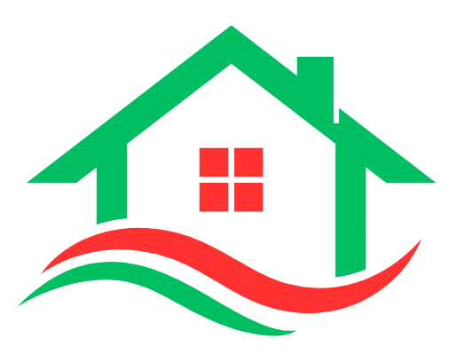

<div align="center">
  
</div>

<div align="center">
  <h1>ঢাকা-বাসা</h1>
</div>

Dhaka-Basha is a modern web application designed to simplify the process of finding and listing rental properties in Dhaka, Bangladesh. Built with Next.js, it provides a seamless and user-friendly experience for both tenants searching for their next home & landlords looking to advertise their "To-Let" properties. The platform features a clean, responsive interface with custom Bengali fonts, real-time messaging, and efficient property management tools.


<div align="center">
  
</div>

*   **User Authentication**: Secure sign-up and login functionality powered by Clerk, including social sign-on with Google.
*   **Property Listings**: Users can create, view, search, edit, and delete their rental property listings with an intuitive form and user dashboard.
*   **Search & Filter**: Find properties easily using filters for location, sub-location, and property type.
*   **Real-time Messaging**: A built-in, real-time chat system powered by Pusher allows tenants and landlords to communicate directly and instantly.
*   **User Profiles & Dashboards**: A personalized profile page for users to manage their listings, view saved properties, and update their personal information.
*   **Save Listings**: Users can save their favorite properties for easy access later.
*   **Efficient Image Handling**: Features client-side image compression before uploading directly to Cloudflare R2, ensuring fast uploads and optimal performance. Includes a rich image gallery component with fullscreen and thumbnail views.
*   **Server-Side Logic**: Utilizes Next.js Server Actions for robust backend operations, from creating listings to managing user data and chat functionalities.

<div align="center">
  
</div>

-   **Framework**: Next.js 16 (App Router)
-   **Language**: TypeScript
-   **Database**: PostgreSQL on Neon (Serverless)
-   **ORM**: Prisma
-   **Authentication**: Clerk
-   **File Storage**: Cloudflare R2
-   **Real-time Communication**: Pusher
-   **Styling**: Tailwind CSS
-   **Form Management**: React Hook Form with Zod for validation
-   **Rate Limiting**: Upstash Redis & Ratelimit
-   **Deployment**: Vercel


<div align="center">
  
</div>

The project follows the standard Next.js App Router structure.

```
.
├── app/
│   ├── (pages)/              # Main route directories
│   ├── actions/              # Server Actions for backend logic
│   ├── api/                  # API routes for webhooks and uploads
│   ├── components/           # Reusable React components
│   └── layout.tsx            # Root layout
├── prisma/
│   └── schema.prisma         # Database schema definition
├── public/
│   ├── fonts/                # Custom Bengali font files
│   └── ...                   # Static assets
└── src/
    └── lib/                  # Shared libraries and utilities (db, constants, etc.)
```

### Core Logic Highlights
-   **`app/actions/*.ts`**: Contains all core business logic as Server Actions. This includes creating listings, handling chat messages, managing user profiles, and saving/deleting posts.
-   **`app/api/webhooks/clerk/route.ts`**: A webhook that listens for Clerk events (`user.created`, `user.updated`, `user.deleted`) to keep the application's user database in sync with Clerk's authentication data.
-   **`app/api/upload/route.ts`**: An API endpoint that generates presigned URLs for secure, direct file uploads from the client to the Cloudflare R2 bucket.
-   **`app/components/ChatRoomClient.tsx`**: A feature-rich, client-side chat component that subscribes to Pusher channels for real-time message updates, providing a smooth messaging experience.
-   **`app/post/page.tsx`**: A comprehensive form component that handles both creating and editing listings. It uses React Hook Form and Zod for robust validation and manages the entire image upload flow, including client-side compression.

<div align="center">
  
</div>

To run this project locally, follow these steps:

1.  **Clone the repository:**
    ```bash
    git clone https://github.com/uzicodes/dhaka-basha.git
    cd dhaka-basha
    ```

2.  **Install dependencies:**
    ```bash
    npm install
    ```

3.  **Set up environment variables:**
    Create a `.env.local` file in the root of the project and add the necessary environment variables.

    ```env
    # Neon Database
    DATABASE_URL="your_neon_postgresql_connection_string"

    # Clerk Authentication
    NEXT_PUBLIC_CLERK_PUBLISHABLE_KEY="your_clerk_publishable_key"
    CLERK_SECRET_KEY="your_clerk_secret_key"
    WEBHOOK_SECRET="your_clerk_webhook_secret"

    # Cloudflare R2 Storage
    R2_ACCOUNT_ID="your_r2_account_id"
    R2_ACCESS_KEY_ID="your_r2_access_key_id"
    R2_SECRET_ACCESS_KEY="your_r2_secret_access_key"
    R2_BUCKET_NAME="your_r2_bucket_name"
    NEXT_PUBLIC_R2_PUBLIC_URL="your_r2_public_url"

    # Pusher Real-time
    PUSHER_APP_ID="your_pusher_app_id"
    NEXT_PUBLIC_PUSHER_KEY="your_public_pusher_key"
    PUSHER_SECRET="your_pusher_secret"
    NEXT_PUBLIC_PUSHER_CLUSTER="your_pusher_cluster"

    # Upstash Redis (for Rate Limiting)
    UPSTASH_REDIS_REST_URL="your_upstash_redis_url"
    UPSTASH_REDIS_REST_TOKEN="your_upstash_redis_token"
    ```

4.  **Sync the database schema:**
    Run the Prisma command to sync your database schema with the models defined in `prisma/schema.prisma`.
    ```bash
    npx prisma db push
    ```
    The `postinstall` script will automatically run `prisma generate`.

5.  **Run the development server:**
    ```bash
    npm run dev
    ```

    The application will be available at `http://localhost:3000`.